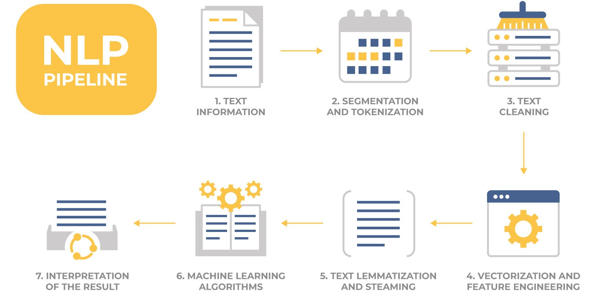
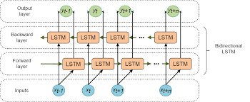
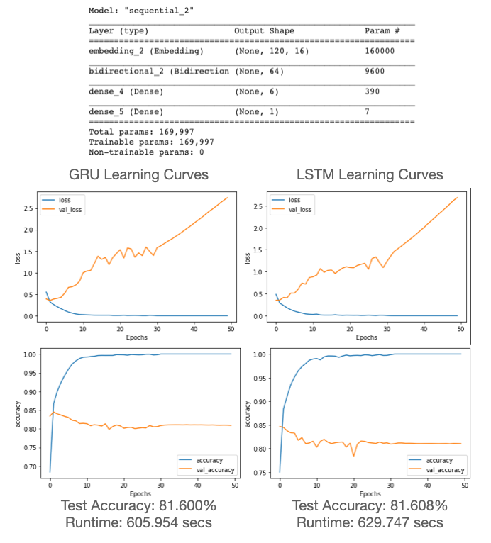
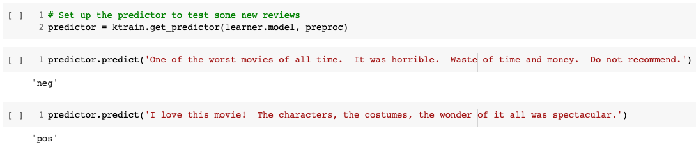
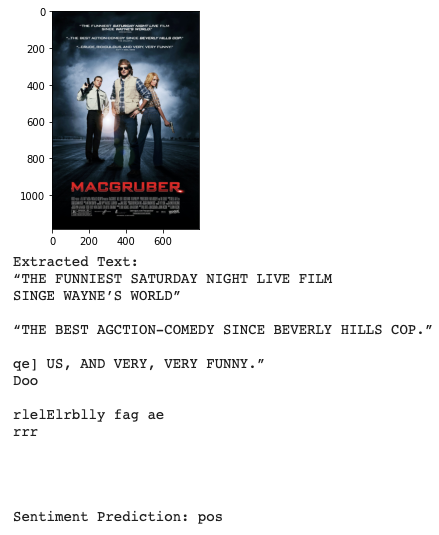

By now you may be pretty familiar with my story so I will skip ahead to the good stuff, with just a brief refresher that I am now preparing for the <a href="https://www.tensorflow.org/certificate" target="_blank">TensorFlow Developer Certificate</a> and really falling in love with deep learning.  It has many useful applications, and one in particular is Natural Language Processing. When you combine computer vision, NLP and voice recognition, artificial intelligence is really starting to feel like the sci-fi movies that inspired us as kids.

This project explored the fundamentals of NLP using the great IMDB reviews dataset.  It is another very popular dataset in machine learning research and contains 50,000 reviews labeled as positive or negative to be used for training and testing as well as an additional 50,000 unlabeled reviews to be used for predictions if desired (I did not use them at this time).  Below is a simple graphic outlying the basic NLP workflow.

    

Choosing the right model for the job is one of the fun challenges of data science.  Natural language processing can be very challenging because of the nuance of the english language.  Some words have multiple meanings, and context matters greatly.  The placement of words within a sentence defines their meaning.

To build a model that can recognize this contextual meaning of our words we will use what is called a Recurrent Neural Network.  An RNN is able to pass information learned through to the model, allowing it to learn the sequences and contexts of the words within the sentences.  This is much more powerful for NLP than a traditional deep learning network.  The image below is an example of an effective NLP deep learning network, showing how information is passed both directions.  This is what gives the model the power to learn the nuances of the sentences.

    

Bear with me on the acronyms for a moment.  To begin, we will use a Gated Recurrent Unit, or GRU.  This is actually a streamlined version of the Long Short-Term Momry algorithm, more commonly referred to as an LSTM and is shown in the image above.  Because it is slightly watered-down so to speak, it should perform a bit faster on the dataset but may not achieve as high of accuracy.  Let's take a look at the two and compare.

    

Okay let's take a look and compare these two basic models for our baseline shown above.  If you just looked at the accuracy ~81% would seem pretty decent, but the diverging loss function and clear overfitting show room for improvement.  It is also always important to consider how our model performance compares to that of an expert level human.  In this case, someone very familiar with movie reviews would likely achieve a much higher accuracy than 81%, so we know we can do a lot better.  Comparing the two models, the more streamlined GRU model was slightly more efficient with the shorter runtime. Interestingly, the accuracy performance is almost the same.  This is not always the case, but with our very simple model and relatively straightforward input sequences the GRU was quite effective. 

With much larger, more complex problems it is very common that you will need to make a decision between performance and efficiency. There is no "silver bullet" to answer the question of which model is "best" for the situation. It always depends on the business case. There are instances where efficiency will be optimized and you simply need to satisfy a given accuracy threshold, and vice versa. Certain architectures will apply more favorably to specific situations but not others.

Although the GRU model would be preferable between the two, before we get too far into the weeds let's step back and think about optimization as a concept in terms of NLP.

More specifically, I like to try to use a **data centric** approach to optimization whenever possible compared to a **model centric** approach.

## Data Centric Development ##

Think of it this way, there are two fundamentally separate ways to optimize your overall performance.  You can fine-tune the parameters and layers of your algorithm, or you can go get more and better data!  And of course most often a combination of both is key.

In the NLP space, when you consider how many words there are in the English language and the intricate semantics, you would want to train on as large of a corpus (collection of text data) as possible.  And that is a perfect seqway into the next phase of this project, **Transfer Learning**.

# Transfer Learning with BERT #

We will be utilizing the **Bidirectional Encoder Representations from Transformers**, better known as our good friend **BERT**.  This will give an excellent opportunity to utilize **Transfer Learning**, a very powerful technique used in deep learning to fast track progress using previously trained models such as BERT.

BERT is a cutting edge NLP model developed by Jacob Devlin and his team at Google in 2018.  The model was trained on English Wikipedia (2,500M words) and BooksCorpus (800M words).  As we have come to realize, that type of training would take massive compute power and time.  Luckily we can just import the model and run with it!  It is worth noting there are two models of BERT, the base model and the large model.  We will be using the base model.

## Working with BERT and ktrain ##

BERT is great.  A very powerful NLP model pretrained on millions of words and a large variety of contexts make it very effective at deciphering the English language.  

However the downside of BERT and other pretrained NLP models is you need to follow very specific preprocessing steps to use the BERT tokenizer on your train and test data.

That is where **ktrain** comes in.  ktrain is a keras wrapper used to help build, train, optimize, debug, and deploy deep learning models.  ktrain is fully integrated with our good buddy BERT and will make streamline dozens of lines of code into a few easy operations.  Let's take a look. 

One quick note, previously we were building our custom functions to integrate with the tfds workflow.  ktrain is built to utilize the get_file workflow from keras.

## BERT Results ##

Utilizing the BERT model and retraining on our dataset we were able to achieve an accuracy of 98.4%!  Incredible gains!  It did take a significantly longer amount of time to train the model (12 minutes to 80 minutes), however.  This is because the BERT model is significantly more complex than our simple model, but clearly much more accurate.  Now that we have our model, ktrain makes it easy to predict on new text.  With just a couple lines of code we had our predictor up and running, and making successful predictions!

    

## Optical Character Recognition with PyTesseract ##

Now one very cool convergence of deep learning technologies is Optical Character Recognition, or OCR.  Imagine a world where you had a notebook full handwritten movie reviews (for some reason...) or better yet you had a folder full of movie posters with critics quotes on them.  You could read in the images, extract the text from the images, and make the sentiment prediction based on that text.  It is actually easier than it sounds thanks to the team at Google and another powerful tool, the Tesseract.  It is designed specifically to make OCR more accessible, and it is a great starter kit.  Combining the predictor from the BERT model with the pytesseract text extractor, I was able to make a prediction based on this MacGruber poster!

    

This has been really fun.  We started by just playing around with different deep learning networks best suited to handle the nuance of the English language and really took off from there, bringing in **transfer learning with BERT and ktrain** as well as **optical character recognition with pytesseract**.  Improved a baseline model from 81% to 95% and built a fun interactive function to cap it off.  All told the notebook takes about 5 hours to run, once again not bad for a (half) days work!

NOTE - the model itself is too large for github, but feel free to run the notebook in Google Colab yourself if you would like to replicate the model!

Resources:
- https://datascience.stackexchange.com/questions/14581/when-to-use-gru-over-lstm
- https://arxiv.org/abs/1810.04805
- https://pypi.org/project/ktrain/
- https://morioh.com/p/12f182398dc4
- https://github.com/lmoroney/dlaicourse/blob/master/TensorFlow%20In%20Practice/Course%203%20-%20NLP/Course%203%20-%20Week%202%20-%20Lesson%203.ipynb
